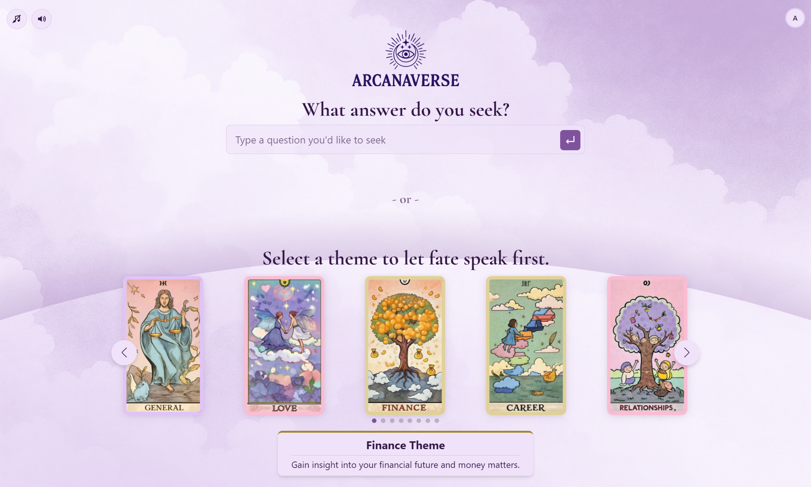
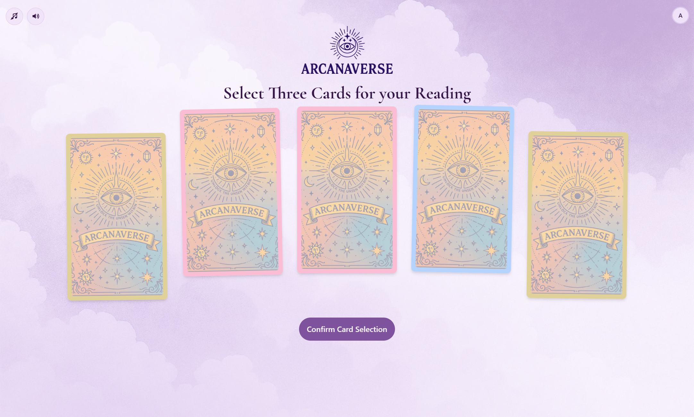
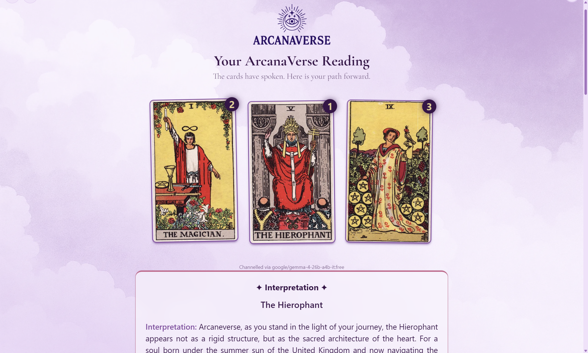

# AI Fortune Teller

AI enabled fortune telling and tarot card reading application.

Produced by Dewey Dong, a senior software engineer.

** live site: **
https://ai-fortune-teller-fe-demo.up.railway.app/home 

## Tech Stack Overview

### Frontend Libraries
Core: **React, Gestalt, React Router, React use, React-error-boundary**

Tools: **Axios, Zustand, Firebase, Dompurify, Vite, Jest, Vitest**

Styling: **Tailwind CSS, Swiper, Sonner, Motion** 

### Backend Framework
Core: **ASP.NET Core, Entity Framework Core, Swagger/OpenAPI, JWT Authentication, xUnit**

Tools: **OpenAI SDK, Docker, Kubernetes**

### Development Tools
 **Docker, Kubernetes, GitHub Actions ESLint, Prettier, Husky**

### Cloud Services
**AWS S3, Amazon RDS for SQL Server, Open Router, Firebase, Digital Ocean**

### Design
**Figma, Figma Color Wheels**

## 🌟 Project Overview

Card Selection

Reading
