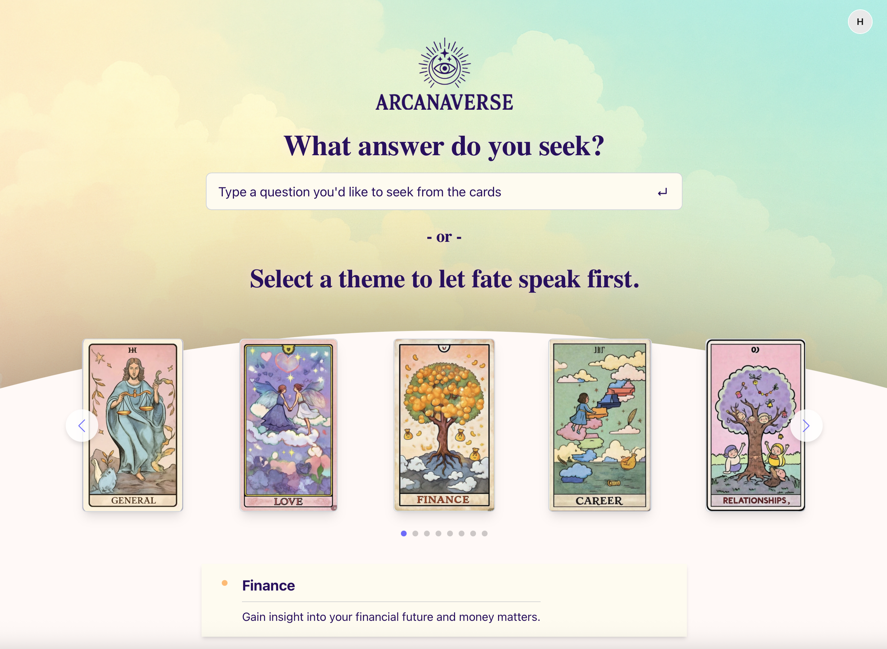

# ArcanaVerse - CS732 Project (Team 42)

[](https://github.com/UOA-CS732-S1-2025/group-project-42/actions/workflows/main.yml)

Welcome to ArcanaVerse, a fortune telling and tarot card reading application developed as part of the CS732 project. This repository contains both frontend and backend components of the application.

**Visit our live site: [ArcanaVerse](https://arcanaverse.xyz/home)**



Our team members are:
- Ching-Yuan Chien _(cchi496@aucklanduni.ac.nz)_
- Katie Zhao _(szha992@aucklanduni.ac.nz)_
- Karson Sun _(ksun421@aucklanduni.ac.nz)_
- Jin Woo Kuk _(jkuk801@aucklanduni.ac.nz)_
- Dewey Dong _(hdon694@aucklanduni.ac.nz)_
- Yvonne Zhang _(byhz801@aucklanduni.ac.nz)_


## 🌟 Project Overview

ArcanaVerse is an interactive fortune telling application featuring:
- Daily horoscopes and fortunes
- Interactive tarot card readings
- Personalized user experiences
- Various thematic readings

## 🚀 Quick Start

### Complete Project Setup

1. Set up and run the backend:
```bash
cd backend/Api
dotnet run
```

2. Set up and run the frontend:
```bash
cd frontend
npm install
npm run dev
```

3. Access the application:
   - Frontend: http://localhost:5173
   - Backend API: http://localhost:5000
   - Swagger Documentation: http://localhost:5000/swagger

### Project Documentation

For more detailed information, refer to the specific component READMEs:

- [Frontend Documentation](./frontend/README.md)
- [Backend Documentation](./backend/README.md)
- [API Documentation](./backend/Api/README.md)
- [Kubernetes Deployment](./kubernetes/README.md)

## 🏗️ Project Structure

Our project follows a clean architecture pattern with clear separation of frontend and backend:

```
group-project-42/
├── frontend/ - React application built with Vite
├── backend/ - ASP.NET Core API with clean architecture
└── kubernetes/ - Kubernetes deployment configurations
```

### Frontend Setup
1. Navigate to the frontend directory:
```bash
cd frontend
```

2. Install dependencies:
```bash
npm install
```

3. Start the development server:
```bash
npm run dev
```

The frontend will be available at `http://localhost:5173`

### Backend Setup
1. Navigate to the API directory:
```bash
cd backend/Api
```

2. Run the API in development mode:
```bash
dotnet run
```

The backend will be available at `http://localhost:5000`

## 💻 Development Guidelines

### Code Quality Standards
We maintain high code quality through automated tooling:

```bash
# Run ESLint to fix code issues
npm run lint

# Format code with Prettier
npm run prettier

# Test code format with Prettier (no changes)
npm run prettier:check

# Run both formatting and linting
npm run format
```

### Git Workflow and Commits

Our project uses branch protections on `main` to ensure quality:

1. Create a feature branch from `main`
2. Make your changes
3. Submit a PR for review
4. After approval, merge to `main`

#### Automated Quality Checks
This project uses Git hooks with Husky that automatically run:
- Prettier formatting
- ESLint validation

These hooks are installed when you run `npm install` in the frontend directory.

#### Backend Testing
To run backend tests:
```bash
cd backend/Api.Tests
dotnet test
```

## 📋 Coding Standards

### Technology Stack

1. **UI Framework**: React with Vite for fast building
2. **Styling**: Tailwind CSS (avoid separate CSS files)
3. **State Management**: React Context with Immer for immutability
4. **UI Components**: Gestalt component library
5. **Data Fetching**: 
   - @tanstack/react-query for server state
   - Axios for HTTP requests
   - Custom hooks for data manipulation

6. **Backend**: ASP.NET Core with clean architecture
   - Controllers for HTTP endpoints
   - Services for business logic
   - Repositories for data access

## 📁 Project Structure Details

Our project follows a well-organized folder structure that promotes maintainability and separation of concerns:

```
group-project-42/
├── 42.png                                # Team logo
├── README.md                             # Main project documentation
├── group-project-42.sln                  # Solution file for the entire project
│
├── frontend/                             # Frontend React application
│   ├── build.sh                          # Frontend build script
│   ├── Dockerfile                        # Frontend Docker configuration
│   ├── package.json                      # Frontend dependencies
│   ├── public/                           # Static assets served directly
│   └── src/                              # Source code
│
├── backend/                              # Backend .NET application
│   ├── backend.sln                       # Backend solution file
│   ├── build.sh                          # Backend build script
│   ├── Dockerfile                        # Backend Docker configuration
│   │
│   ├── Api/                              # Main API project
│   │   ├── Api.csproj                    # Project file
│   │   ├── Program.cs                    # Entry point
│   │   ├── appsettings.json              # Configuration settings
│   │   ├── firebase-credentials.json     # Firebase auth credentials
│   │   ├── Controllers/                  # API endpoints
│   │   ├── Data/                         # Database context
│   │   ├── Infrastructure/               # Application setup
│   │   ├── Middleware/                   # Custom middleware
│   │   ├── Migrations/                   # EF Core migrations
│   │   ├── Models/                       # Data models
│   │   ├── Repositories/                 # Data access layer
│   │   └── Services/                     # Business logic
│   │       ├── Implementations/          # Service implementations
│   │       └── Interfaces/               # Service interfaces
│   │
│   ├── Api.Tests/                        # Unit and integration tests
│   │   ├── Api.Tests.csproj              # Test project file
│   │   └── Services/                     # Service tests
│   │
│   └── Tools/                            # Developer utilities
│       └── TokenGenerator/               # JWT token generator
│
└── kubernetes/                           # Kubernetes deployment
```

### Frontend Code Style

1. **Component Organization**:
   - Reused components put under `components` folder
   - One component per subfolder
   - Each component should be in its own directory with supporting files
   - Use `index.js` files for clean imports
   - Component-specific styles should use Tailwind utility classes
   ```javascript
      // index.js
      export { default } from './ComponentName.jsx'

      // Usage. E.g. HomePage.jsx
      import ComponentName from 'components/ComponentName'
      // instead of
      import ComponentName from 'components/ComponentName.jsx'
   ```

2. **Context Management**:
   - Separate context definition from provider implementation
   - Use index.js files to export both pieces together

3. **Naming Conventions**:
   - Use PascalCase for component files and directories
   - Use camelCase for utility files
   - Use descriptive, purpose-oriented names

4. **Code Splitting**:
   - Keep files focused on a single responsibility
   - Avoid large monolithic components
   - Extract reusable logic into custom hooks

## Technology Stack Details

### Frontend Libraries
1. **React Router**: For application routing
2. **Tailwind CSS**: For styling with utility classes
3. **Immer**: For simplified immutable state management
4. **Gestalt**: Pinterest's UI component library
5. **react-use**: Collection of essential React hooks
6. **@tanstack/react-query**: For efficient server state management
7. **Axios**: For HTTP requests

### Backend Framework
1. **ASP.NET Core**: Web API framework
2. **Entity Framework Core**: For database access
3. **Swagger/OpenAPI**: For API documentation
4. **JWT Authentication**: For secure API access
5. **xUnit**: For backend testing

### Development Tools
1. **ESLint**: For code linting
2. **Prettier**: For code formatting
3. **Husky**: For Git hooks
4. **Docker**: For containerization
5. **Kubernetes**: For orchestration

## 🔄 CI/CD Workflow

Our project leverages GitHub Actions for continuous integration and deployment, automating the testing, building, and deployment processes.

### CI/CD Pipeline

The workflow consists of the following stages:

1. **Code Validation**
   - Triggered on: Pull requests to `main` branch
   - Runs linting and formatting checks
   - Executes unit tests for frontend and backend
   - Ensures code quality before merging

2. **Build & Deployment**
   - Triggered on: Push to `main` branch
   - Builds Docker images for frontend and backend
      - Pushes Docker images to container registry
   - Deploys to Kubernetes cluster using manifests in the kubernetes directory
   - Updates application with zero downtime

### Workflow Status

You can check the status of recent workflow runs on the [GitHub Actions tab](https://github.com/yourusername/group-project-42/actions) of our repository.